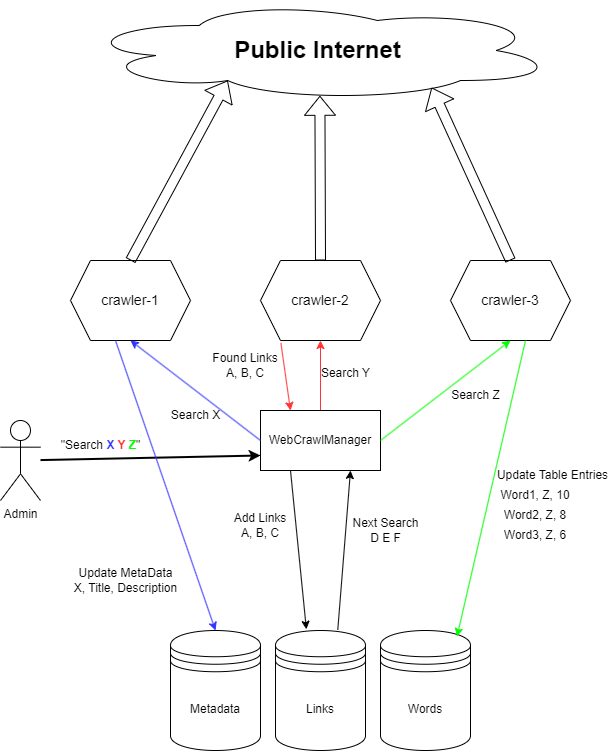

# Distributed Web Crawler

This project is a distributed web crawler designed to crawl websites, track the frequency of words, and manage metadata of visited URLs. Built with **GoLang**, containerized using **Docker**, and deployed on **Google Cloud Kubernetes**, the system operates as a scalable and efficient solution for web crawling.

## Features

- **Distributed Crawling**: Multiple crawler containers work in parallel to scan web pages.
- **Word Frequency Analysis**: Tracks and indexes the frequency of words from the crawled pages.
- **URL Metadata Management**: Extracts and stores the title and description of each visited page.
- **Link Discovery**: Finds and manages links from crawled pages to enable recursive crawling.
- **Centralized Management**: A manager container handles communication with crawlers, manages the links database, and ensures efficient task distribution.

## Architecture Overview

1. **Manager Container**:
   - Receives crawl start requests via a specified port.
   - Manages the list of links to be crawled in the database.
   - Assigns URLs to crawler containers for processing.

2. **Crawler Containers**:
   - Retrieve assigned URLs from the manager.
   - Extract words and their frequencies from the webpage.
   - Add metadata (title and description) to the database.
   - Discover new links and send them back to the manager.

3. **Databases**:
   - **Metadata Database**: Stores the title and description of visited pages.
   - **Word Index Database**: Tracks the frequency of words across all crawled pages.
   - **Links Table**: Maintains a list of URLs to be crawled, ensuring no duplicates.

## Deployment

The system is deployed on **Google Cloud Kubernetes** for scalability and fault tolerance. Docker images for each component (manager and crawler) are pushed to Google Cloud Container Registry.

## Deployment Instructions Coming Soon

## Future Enhancements

- **Dynamic Scaling**: Implement autoscaling for crawler containers based on load.
- **Error Handling**: Improve handling of failed or unreachable URLs.
- **Dashboard**: Add a web-based dashboard to monitor crawl progress and visualize data.

